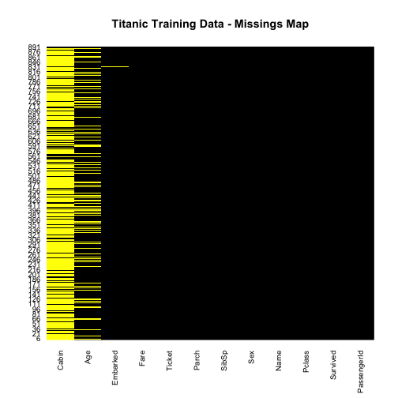

Titanic analysis
========================================================

First, create some helper functions


```r
readData <- function(path.name, file.name, column.types, missing.types) {
  read.csv( paste(path.name, file.name, sep=""), 
            colClasses=column.types,
            na.strings=missing.types )
}

getTitle <- function(data) {
  title.dot.start <- regexpr("\\,[A-Z ]{1,20}\\.", data$Name, TRUE)
  title.comma.end <- title.dot.start + attr(title.dot.start, "match.length")-1
  data$Title <- substr(data$Name, title.dot.start+2, title.comma.end-1)
  return (data$Title)
}

Titanic.path <- "~/Developer/Kaggle/Titanic/"
train.data.file <- "train.csv"
test.data.file <- "test.csv"
missing.types <- c("NA", "")
train.column.types <- c('integer',   # PassengerId
                        'factor',    # Survived
                        'factor',    # Pclass
                        'character', # Name
                        'factor',    # Sex
                        'numeric',   # Age
                        'integer',   # SibSp
                        'integer',   # Parch
                        'character', # Ticket
                        'numeric',   # Fare
                        'character', # Cabin
                        'factor'     # Embarked
)
test.column.types <- train.column.types[-2]
train.raw <- readData(Titanic.path, train.data.file,
                      train.column.types, missing.types)
df.train <- train.raw
test.raw <- readData(Titanic.path, test.data.file,
                     test.column.types, missing.types)
df.infer <- test.raw

require(Amelia)
```

```
## Loading required package: Amelia
## Loading required package: foreign
## Loading required package: Rcpp
## Loading required package: RcppArmadillo
## ## 
## ## Amelia II: Multiple Imputation
## ## (Version 1.7.2, built: 2013-04-03)
## ## Copyright (C) 2005-2014 James Honaker, Gary King and Matthew Blackwell
## ## Refer to http://gking.harvard.edu/amelia/ for more information
## ##
```

```r
missmap(df.train, main="Titanic Training Data - Missings Map",
        col = c("yellow", "black"), legend = FALSE)
```

 

```r

df.train$Title <- getTitle(df.train)
```


Consolidating the various titles


```r
changeTitles <- function(data, old.titles, new.title) {
    for (honorific in old.titles) {
        data$New.Title[which(data$Title == honorific)] <- new.title
    }
    return(data$New.Title)
}
df.train$New.Title <- df.train$Title
df.train$New.Title <- changeTitles(df.train, c("Capt", "Col", "Don", "Dr", "Jonkheer", 
    "Lady", "Major", "Rev", "Sir"), "Noble")
df.train$New.Title <- changeTitles(df.train, c("the Countess", "Ms"), "Mrs")
df.train$New.Title <- changeTitles(df.train, c("Mlle", "Mme"), "Miss")
df.train$New.Title <- as.factor(df.train$New.Title)
```


I'm going to try to get average age based on NEW title and class


```r
df.train$TitleClass <- paste0(df.train$New.Title, df.train$Pclass)
avg.age.by.titleclass <- tapply(df.train$Age, df.train$TitleClass, FUN = mean, 
    na.rm = TRUE)
df.train$Impute.Age <- avg.age.by.titleclass[df.train$TitleClass]
df.train$New.Age <- df.train$Age
df.train$New.Age[which(is.na(df.train$Age))] <- df.train$Impute.Age[which(is.na(df.train$Age))]

df.train$Fare.Temp <- df.train$Fare
df.train$Fare.Temp[which(df.train$Fare == 0)] <- NA
avg.fare.by.titleclass <- tapply(df.train$Fare.Temp, df.train$TitleClass, FUN = mean, 
    na.rm = TRUE)
df.train$Impute.Fare <- avg.fare.by.titleclass[df.train$TitleClass]
df.train$New.Fare <- df.train$Fare
df.train$New.Fare[which(df.train$Fare == 0)] <- df.train$Impute.Fare[which(df.train$Fare == 
    0)]
```


Then a whole bunch more feature re-engineering (not all of which I necessarily agree with at this point...)


```r
require(plyr)  # for the revalue function 
```

```
## Loading required package: plyr
```

```r
require(stringr)  # for the str_sub function
```

```
## Loading required package: stringr
```

```r

## test a character as an EVEN single digit
isEven <- function(x) x %in% c("0", "2", "4", "6", "8")
## test a character as an ODD single digit
isOdd <- function(x) x %in% c("1", "3", "5", "7", "9")

## function to add features to training or test data frames
featureEngrg <- function(data) {
    ## Using Fate ILO Survived because term is shorter and just sounds good
    data$Fate <- data$Survived
    ## Revaluing Fate factor to ease assessment of confusion matrices later
    data$Fate <- revalue(data$Fate, c(`1` = "Survived", `0` = "Perished"))
    ## Boat.dibs attempts to capture the 'women and children first' policy in one
    ## feature.  Assuming all females plus males under 15 got 'dibs' on access to
    ## a lifeboat
    data$Boat.Dibs <- "No"
    data$Boat.Dibs[which(data$Sex == "female" | data$Age < 15)] <- "Yes"
    data$Boat.Dibs <- as.factor(data$Boat.Dibs)
    ## Family consolidates siblings and spouses (SibSp) plus parents and children
    ## (Parch) into one feature
    data$Family <- data$SibSp + data$Parch
    ## Fare.pp attempts to adjust group purchases by size of family
    data$Fare.pp <- data$New.Fare/(data$Family + 1)
    ## Giving the traveling class feature a new look
    data$Class <- data$Pclass
    data$Class <- revalue(data$Class, c(`1` = "First", `2` = "Second", `3` = "Third"))
    ## First character in Cabin number represents the Deck
    data$Deck <- substring(data$Cabin, 1, 1)
    data$Deck[which(is.na(data$Deck))] <- "UNK"
    data$Deck <- as.factor(data$Deck)
    ## Odd-numbered cabins were reportedly on the port side of the ship
    ## Even-numbered cabins assigned Side='starboard'
    data$Cabin.Last.Digit <- str_sub(data$Cabin, -1)
    data$Side <- "UNK"
    data$Side[which(isEven(data$Cabin.Last.Digit))] <- "port"
    data$Side[which(isOdd(data$Cabin.Last.Digit))] <- "starboard"
    data$Side <- as.factor(data$Side)
    data$Cabin.Last.Digit <- NULL
    return(data)
}

## not sure I love this, but OK
df.train$Embarked[which(is.na(df.train$Embarked))] <- "S"

## add remaining features to training data frame
df.train <- featureEngrg(df.train)
train.keeps <- c("Fate", "Sex", "Boat.Dibs", "New.Age", "New.Title", "Class", 
    "Deck", "Side", "New.Fare", "Fare.pp", "Embarked", "Family")
df.train.munged <- df.train[train.keeps]
```


Further split the training set into test / training


```r
require(caret)
```

```
## Loading required package: caret
## Loading required package: lattice
## Loading required package: ggplot2
```

```r
set.seed(23)
training.rows <- createDataPartition(df.train.munged$Fate, p = 0.8, list = FALSE)
train.batch <- df.train.munged[training.rows, ]
test.batch <- df.train.munged[-training.rows, ]
```


```r
titanic.logit.1 <- glm(Fate ~ Sex + Class + New.Age + Family + Embarked + New.Fare, 
    data = train.batch, family = binomial("logit"))
anova(titanic.logit.1, test = "Chisq")
```

```
## Analysis of Deviance Table
## 
## Model: binomial, link: logit
## 
## Response: Fate
## 
## Terms added sequentially (first to last)
## 
## 
##          Df Deviance Resid. Df Resid. Dev Pr(>Chi)    
## NULL                       713        951             
## Sex       1    202.7       712        748  < 2e-16 ***
## Class     2     76.1       710        672  < 2e-16 ***
## New.Age   1     26.3       709        646  2.9e-07 ***
## Family    1     12.4       708        633  0.00042 ***
## Embarked  2      4.8       706        628  0.08883 .  
## New.Fare  1      0.4       705        628  0.54791    
## ---
## Signif. codes:  0 '***' 0.001 '**' 0.01 '*' 0.05 '.' 0.1 ' ' 1
```

